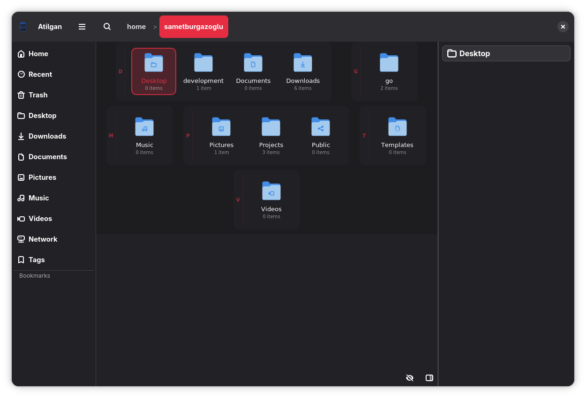

# Atilgan File Manager

Atilgan is a fast, lightweight, and modern file manager for Linux, meticulously crafted using the Go programming language and the GTK4 toolkit. It offers a clean and intuitive interface that focuses on providing a seamless file navigation experience without unnecessary bloat.



https://github.com/user-attachments/assets/6ec71452-fd24-41bd-aeb2-4b1af8bf5939

## Features

*   **Efficient Browsing:** Browse your files and directories with a responsive list view.
*   **Integrated Previews:** Built-in previewer for images, text files, documents, and media.
*   **Smart Navigation:** Interactive breadcrumb path bar for easily moving through your system.
*   **Sidebar Shortcuts:** Quick access to home, documents, downloads, and other special paths.
*   **Search Capabilities:** Instant file and directory search within your current path.
*   **File Operations:** Full support for rename, copy, cut, and paste.
*   **Tags:** Organize your files with custom tags for easy categorization.
*   **Keyboard Driven:** Rich set of keyboard shortcuts designed for power users.

## Prerequisites

### Development Libraries
Before building Atilgan from source, you need to install the development libraries for GTK4, libadwaita, and gtksourceview.

**On Debian/Ubuntu:**
```bash
sudo apt-get install libgtk-4-dev libadwaita-1-dev gtksourceview5-dev
```

**On Fedora:**
```bash
sudo dnf install gtk4-devel libadwaita-devel gtksourceview5-devel
```

### Runtime Dependencies for Previews
For the file previewer to work correctly with all file types, you need to install the following packages:

*   **PDF Previews:** `pdftoppm` (usually part of the `poppler-utils` package)
    *   Debian/Ubuntu: `sudo apt-get install poppler-utils`
    *   Fedora: `sudo dnf install poppler-utils`
*   **Document Previews:** `unoconv`
    *   Debian/Ubuntu: `sudo apt-get install unoconv`
    *   Fedora: `sudo dnf install unoconv`
*   **Media Previews:**
    *   Debian/Ubuntu: `sudo apt-get install ubuntu-restricted-extras`
    *   Other distros may need GStreamer plugins for various media formats.

## Installation

### Method 1: Building from Source

1.  **Clone the repository:**
    ```bash
    git clone https://github.com/MrSametBurgazoglu/AtilganFileManager.git
    cd AtilganFileManager
    ```

2.  **Build the application:**
    ```bash
    go build -o atilgan .
    ```

3.  **Run the application:**
    ```bash
    ./atilgan
    ```

### Method 2: Building via Flatpak

You can build and run the application as a Flatpak using the provided manifest:

1.  **Install Flatpak Builder:**
    ```bash
    flatpak install flathub org.flatpak.Builder
    ```

2.  **Build and run the app:**
    ```bash
    flatpak-builder --user --install --force-clean build-dir io.github.mrsametburgazoglu.AtilganFileManager.yaml
    flatpak run io.github.mrsametburgazoglu.AtilganFileManager
    ```

## Shortcuts

| Shortcut      | Action                                       |
|---------------|----------------------------------------------|
| `Ctrl + R`    | Rename the selected file or directory.       |
| `Ctrl + F`    | Toggle the search bar.                       |
| `Ctrl + C`    | Copy the selected file or directory.         |
| `Ctrl + X`    | Cut the selected file or directory.          |
| `Ctrl + V`    | Paste the copied/cut file or directory.      |
| `Ctrl + H`    | Show the shortcuts help popup.               |
| `Escape`      | Clear the copied/cut files.                  |
| `Shift + [A-Z]` | Select the next file starting with the letter. |
| `Left Arrow`  | Go to the parent directory.                  |
| `Right Arrow` | Go into the selected directory.              |

## License

This project is open-source. Please check the `LICENSE` file for more details. (Application metadata indicates GPL-3.0-or-later).
